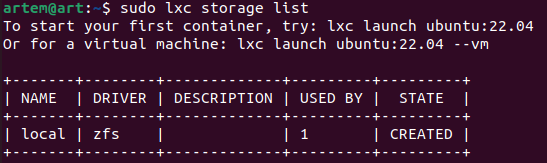
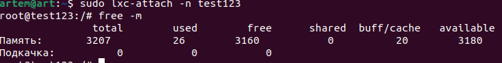
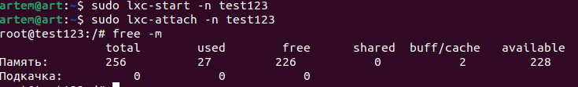
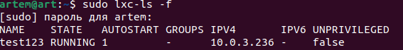

# Контейнеризация (семинары)

## *Урок 2.*  Механизмы контрольных групп

Задание 1:
+ 1 запустить контейнер с ubuntu, используя механизм LXC
+ 2 ограничить контейнер 256 Мб ОЗУ и проверить, что ограничение работает
+ 3 добавить автозапуск контейнеру, перезагрузить ОС и убедиться, что контейнер действительно запустился самостоятельно
+ 4 при создании указать файл, куда записывать логи
+ 5 после перезагрузки проанализировать логи

Решение:

* Установим LXC и шаблоны:  

sudo apt install lxc lxc-templates uidmap

* 

sudo apt-get install lxd-installer

* Иницилизируем lxd

lxd init

* Проверяем

sudo lxc storage list

* Создаем контейнер с именем test123

sudo lxc-create -n test123 -t ubuntu

* Запускаем контейнер

sudo lxc-start -n test12

* Войдем в созданный контейнер

sudo lxc-attach -n teat123

* Проверяем память

free -m 

Выходим(exit)

* Останавливаем контейнер

sudo lxc-stop -n test123

* Открываем файл 

nano /var/lib/lxc/test123/config-открываем

Вставляем эту строчку  
lxc.cgroup2.memory.max = 256M

* Запускаем и входим в контейнер и проверяем память. Видим, что ограничение работает.

* Открывваем файл.

sudo nano /var/lib/lxc/testOne/config
 
 и вставляем в конец текста 

 lxc.start.auto = 1

 Сохраняем, ваыходим и перезагружаем систему.

* Выполняем команду и проверяем автозапуск контейнера и убежадемся, что он включен.

sudo lxc-ls -f

