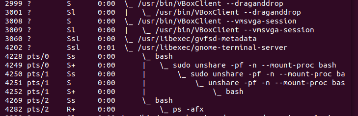
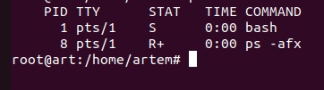
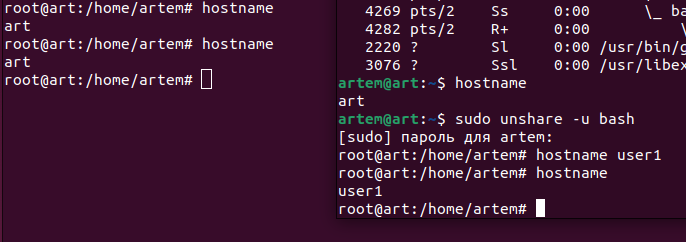

# Контейнеризация (семинары)

## *Урок 1.* Механизмы пространства имен

Задание: необходимо продемонстрировать изоляцию одного и того же приложения (как решено на семинаре - командного интерпретатора) в различных пространствах имен.  
*Формат сдачи ДЗ:* предоставить доказательства выполнения задания посредством ссылки на google-документ с правами на комментирование/редактирование.

### Решение:

- Запустим Bash в новом пространстве имен командой  

sudo unshare -pf -n --mount-proc bash

- В параллельном терминале смотрим, что произошло  

ps -afx

- Для проверки и наглядности смотрим той же командой ps -afx в изолированном терминале

- Далее, из этого же терминала, пробуем запустить пинг любого сайта, например ya.ru.  

ping ya.ru

ping: ya.ru: Временный сбой в разрешении имен     

Наблюдаем, что пинг до указанного сайта не может быть осуществлен, так как сеть в этом пронстранстве имен имеется только локальная, т.е. localhost.

Этаже команда введенная в не изолированном терминале работает  ответ от сервера принимается.
- Проверяем hostname в двух терминалах командой 

hostname

hostname одинаков.

- в изолированном терминале выполняем команду: 

sudo unshare -u bash

Команда $ unshare запускает программу (опционально) в новом namespace. Флаг -u говорит ей запустить bash в новом UTS namespace. Обратите внимание, что наш новый процесс bash указывает на другой файл UTS, тогда как все остальные остаются прежними.

Одним из следствий того, что мы только что проделали, является то, что теперь мы можем изменить системный hostname из нашего нового процесса bash и это не повлияет ни на какой другой процесс в системе. Изменим наш хост в изолированном терминале, например:

hostname user1

Эта команда никак не затронула хост основной системы. Можем проверить это, выполнив hostname

