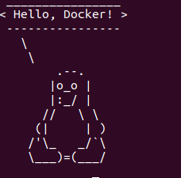

# Контейнеризация (семинары)

## *Урок 3.*  Введение в Docker.

* ## 1 - устанавливаем Докер

Обновите списки пакетов:

sudo apt update

Установите пакеты, которые позволят использовать репозиторий по HTTPS:  

sudo apt install apt-transport-https ca-certificates curl software-properties-common

Добавьте официальный GPG-ключ Docker:

curl -fsSL https://download.docker.com/linux/ubuntu/gpg | sudo gpg --dearmor -o /usr/share/keyrings/docker-archive-keyring.gpg

Добавьте репозиторий Docker к списку источников пакетов:  

echo "deb [signed-by=/usr/share/keyrings/docker-archive-keyring.gpg] https://download.docker.com/linux/ubuntu $(lsb_release -cs) stable" | sudo tee /etc/apt/sources.list.d/docker.list > /dev/null

Обновите список пакетов, чтобы включить информацию о пакетах Docker из добавленного репозитория:

sudo apt update

Установите Docker:

sudo apt install docker-ce

Добавьте вашего пользователя в группу docker, чтобы избежать использования sudo для запуска Docker команд:

sudo usermod -aG docker $USER

Перезагрузите систему или запустите следующую команду, чтобы применить изменения в текущем сеансе:

newgrp docker

Теперь вы должны быть готовы использовать Docker через терминал. Вы можете проверить его работу, выполнив команду:

docker --version

* ## 2 -тестируем.

Запустите контейнер с использованием образа "cowsay". Команда будет выглядеть так:

docker run docker/whalesay cowsay Hello, Docker!

В данном примере используется образ "docker/whalesay", который содержит утилиту "cowsay". Он будет выводить на экран сообщение "Hello, Docker!" с помощью рисунка коровы.

Запустить контейнер с рисунком слона:

docker run docker/whalesay cowsay -f elephant "Hello, Docker!"

Запустить контейнер с рисунком пингвина:

docker run docker/whalesay cowsay -f tux "Hello, Docker!"

* ## 3 - тестируем команды.

Создание и запуск контейнеров:

docker run: Запускает контейнер из образа.  

docker start: Запускает остановленный контейнер.

docker stop: Останавливает работающий контейнер.

docker restart: Перезапускает контейнер.

docker exec: Выполняет команду внутри запущенного 
контейнера.

Управление контейнерами:

docker rm $(docker ps -aq): удалит все остановленные контейнеры

docker ps: Просмотр списка запущенных контейнеров.

docker ps -a: Просмотр списка всех контейнеров 
(включая остановленные).

docker rm: Удаляет контейнер.

docker logs: Просмотр логов контейнера.

Работа с образами:

docker images: Просмотр списка образов.

docker pull: Загрузка образа с Docker Hub.

docker build: Сборка образа из Dockerfile.

docker rmi: Удаляет образ.

* ## 4- Хранение данных в контейнерах Docker: Руководство с пояснениями

**Часть-1**

В данной методичке мы рассмотрим примеры хранения файлов в контейнерах Docker. Параллельно с теоретическими пояснениями, студенты также будут выполнять практические задания для лучшего понимания материала.

Задачи:

Для начала давайте запустим контейнер из образа Ubuntu и войдем в него:

docker run -it -h GB --name gb-test ubuntu:22.10

Посмотрим содержимое корневой директории:

ls -l /
Создадим новую директорию в корне:

mkdir /example

Создадим файл "passwords.txt" и добавим в него какие-либо данные (представим, что это данные сайта или базы данных). Но что делать, если у нас нет редактора? Продолжим.

touch /example/passwords.txt
echo "123test" >> /example/passwords.txt
Объяснение:
Мы создали директорию и файл внутри контейнера Ubuntu.

Задача:
Давайте попробуем остановить контейнер и затем запустить его снова. Сохранятся ли наши данные?

docker stop gb-test

docker start gb-test

docker exec -it gb-test bash

cat /example/passwords.txt

Объяснение:
Наши данные сохранятся, так как мы не пересоздавали контейнер.

Задача:
Удалим контейнер и создадим его заново, используя те же команды:

docker stop gb-test

docker rm gb-test

docker run -it -h GB --name gb-test ubuntu:22.10

Объяснение:
В этот раз наши данные будут утеряны, так как контейнер был удален.

Задача:
Рассмотрим наиболее интересный вариант - использование внешнего хранилища. Создадим директорию и подмонтируем ее к контейнеру:

mkdir /test/folder

docker run -it -h GB --name gb-test -v /test/folder:/otherway ubuntu:22.10

Объяснение:
Мы создали директорию и подмонтировали ее в контейнер, что позволило нам сохранить данные.

Задача:
Добавим данные в подмонтированную директорию:

echo "$HOSTNAME" >> /otherway/test.txt

Объяснение:
Мы добавили данные в подмонтированную директорию.

Задача:
Проверим доступность данных с локальной системы:

cat /test/folder/test.txt

Задача:
Удалим контейнер и создадим его снова, подмонтировав директорию:

docker rm gb-test

docker run -it -h GB --name gb-test -v /test/folder:/otherway 
ubuntu:22.10

Объяснение:
Мы видим, что данные по-прежнему доступны.

Заключение:
Самый надежный способ хранения данных в контейнерах - использование внешних хранилищ. Важно избегать хранения важных данных внутри контейнеров, чтобы предотвратить потерю информации.

**Часть-2** Хранение данных в контейнерах Docker: Практическое руководство

В этой части мы рассмотрим практические примеры хранения данных в контейнерах Docker. Мы также рассмотрим случаи использования монтирования папок и файлов__ в контейнерах.

Задачи:

Создайте папку, которую мы будем готовы смонтировать в контейнер:

mkdir ~/docker-mount-example

В этой папке создайте файл test.txt и наполните его данными:

echo "This is the host test.txt file" > ~/docker-mount-example/test.txt
В домашней директории создайте файл test.txt, который также понадобится для монтирования в контейнер, но с другим содержимым:

echo "This is the root test.txt file" > ~/test.txt

Создайте контейнер из образа ubuntu:22.10 и задайте ему имя и hostname:

docker run -it -h GB --name gb-test ubuntu:22.10
Смонтируйте ранее созданную папку с хоста в контейнер:

docker run -it -h GB --name gb-test -v ~/docker-mount-example:/container-mount ubuntu:22.10
Смонтируйте созданный ранее текстовый файл из домашней директории внутрь смонтированной папки в контейнере:

docker run -it -h GB --name gb-test -v ~/docker-mount-example:/container-mount -v ~/test.txt:/container-mount/test.txt ubuntu:22.10
Посмотрите содержимое текстового файла в контейнере:

cat /container-mount/test.txt

Мы создали контейнер и монтировали папку docker-mount-example внутрь контейнера. Затем мы монтировали файл test.txt из домашней директории внутрь этой папки в контейнере. При просмотре содержимого файла в контейнере, вы увидите данные из файла в домашней директории.