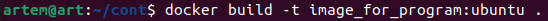

# Контейнеризация (семинары)

## *Урок 4.*  Dockerfile и слои.

**Задание:**   необходимо создать Dockerfile, основанный на любом образе (вы в праве выбрать самостоятельно).
В него необходимо поместить приложение, написанное на любом известном вам языке программирования (Python, Java, C, С#, C++).
При запуске контейнера должно запускаться самостоятельно написанное приложение.

**Решение:**

[Файл java](program.java)

[Файл docker](Dockerfile)

