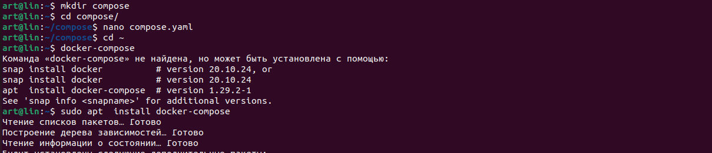
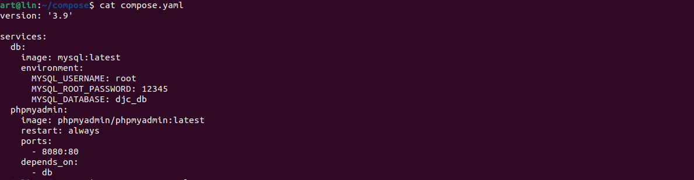
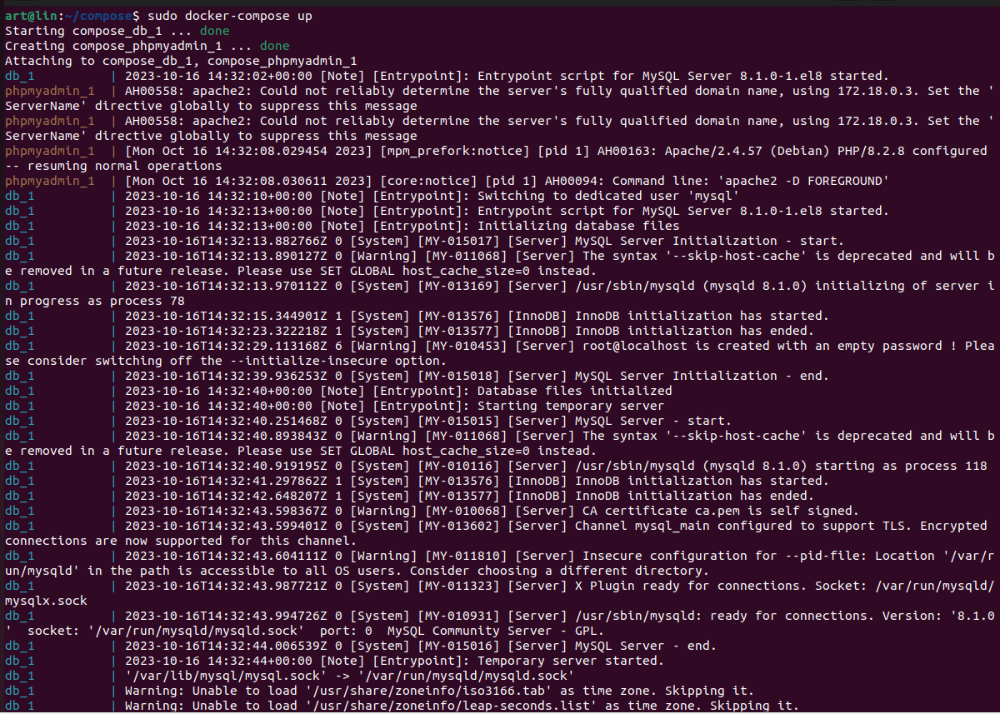
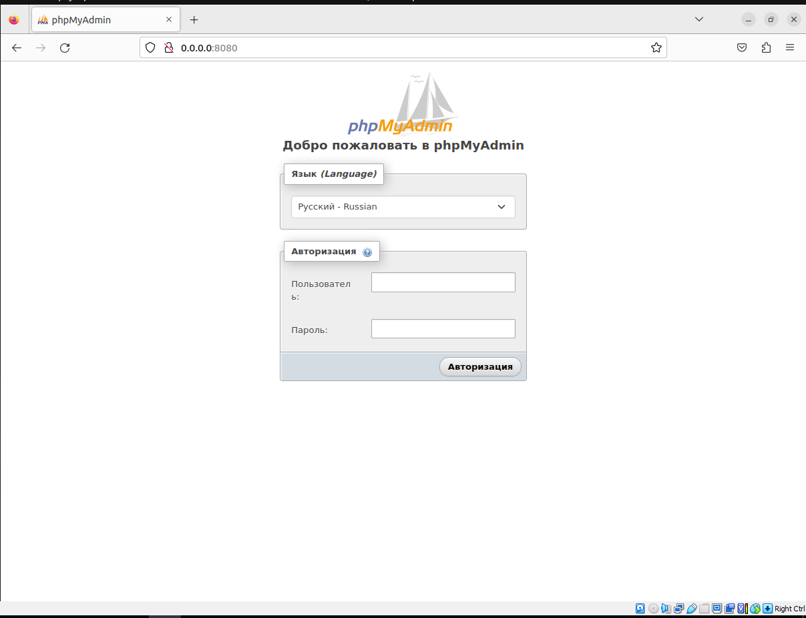
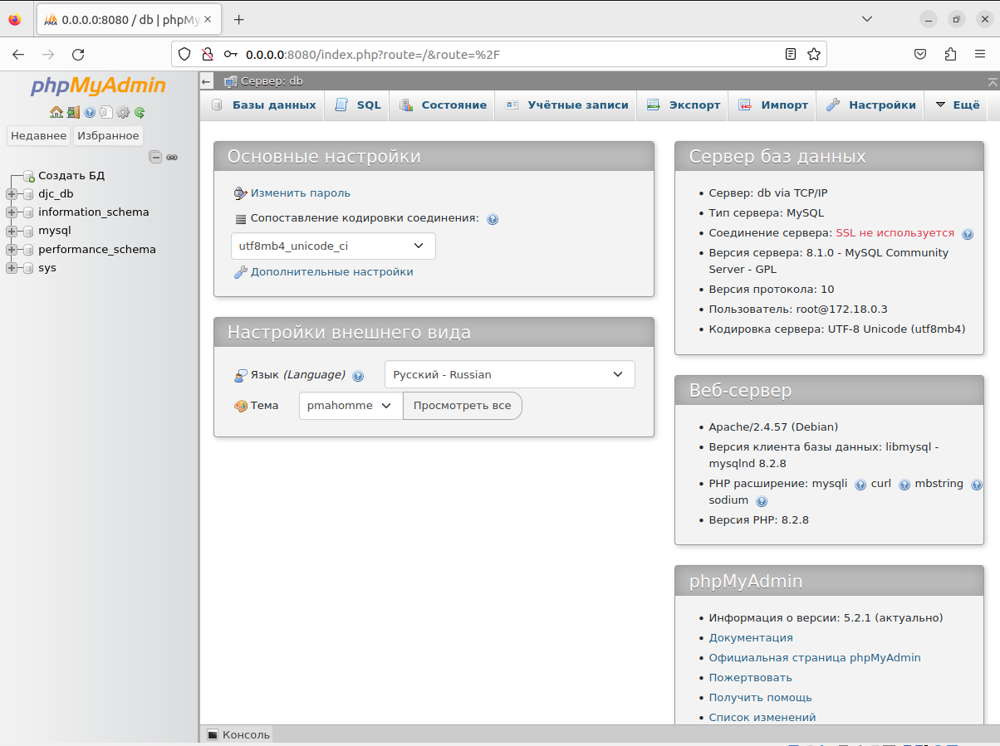

# Контейнеризация (семинары)

## *Урок 5.*   Docker Compose и Docker Swarm

**Задание:** 1 создать сервис, состоящий из 2 различных контейнеров: 1 - веб, 2 - БД (compose) выводы зафиксировать  
Задание со звездочкой - повышенной сложности..  
** не обязательно 2) необходимо создать 3 сервиса в каждом окружении (dev, prod, lab)  
** не обязательно 3) по итогу на каждой ноде должно быть по 2 работающих контейнера

**Решение:**

 Создаем директорию compose, через редактор nano добавляем файл compose.yaml:

 mkdir compose  
 cd compose/  
 nano compose.yaml  

 

Добавляем содержимое файлa compose.yaml:

 

Запускаем .yaml файл

sudo docker-compose up

